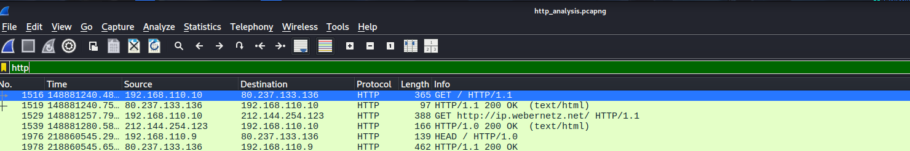
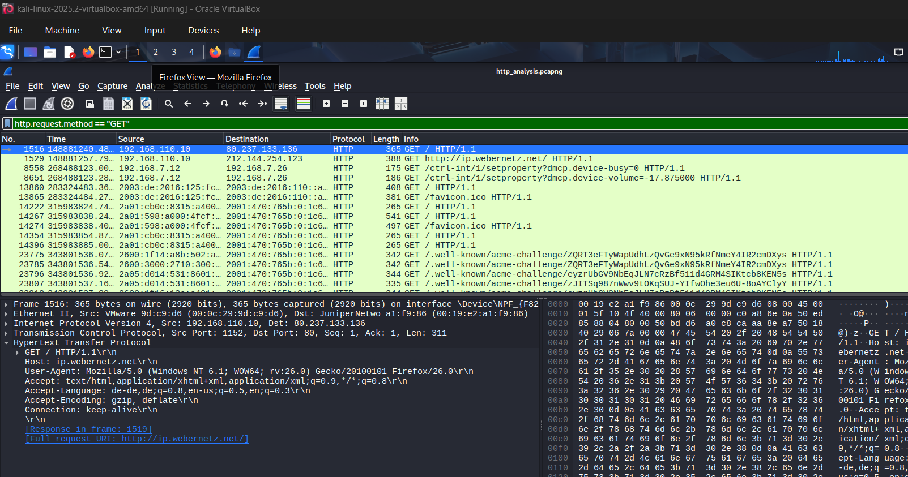
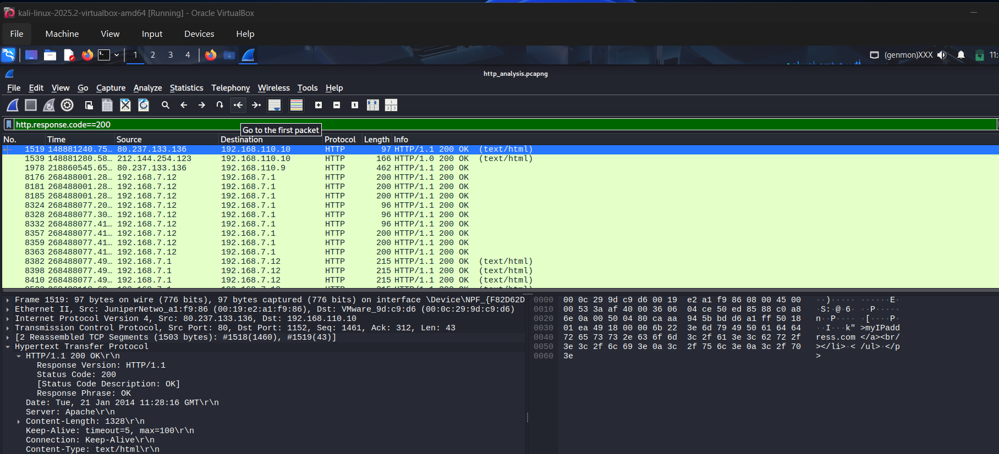
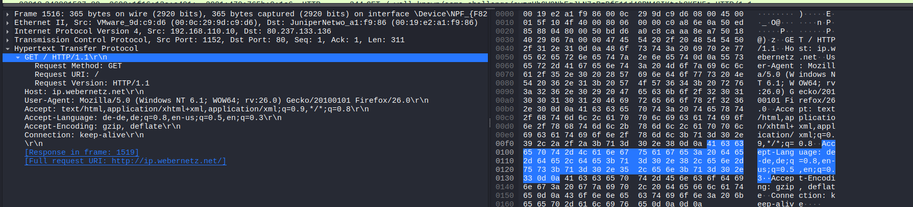

# HTTP Packet Analysis using Wireshark

## Objective
The objective of this analysis is to understand how HTTP communication
works by analyzing client requests and server responses using Wireshark.

## Tool Used
- Wireshark

## Data Source
The PCAP file used for this analysis was provided as part of a structured
cybersecurity training lab for hands-on learning.

## Method / Filter
HTTP traffic was isolated using Wireshark display filters to analyze
requests, responses, headers, and status codes.

---

## Common HTTP Display Filters Used

| Filter | Description |
|------|------------|
| `http` | Show all HTTP traffic |
| `tcp.port == 80` | HTTP traffic by default port |
| `http.request.method == "GET"` | Show all GET requests |
| `http.request.uri` | View requested resources |
| `http.set_cookie` | Show cookies in HTTP responses |
| `ip.addr == 192.168.1.10` | HTTP traffic to/from specific host |

---

## HTTP Packet List
The screenshot below shows HTTP traffic filtered using the `http` display
filter.

---

## HTTP Request (GET)
HTTP GET requests are sent by the client to request resources from a web
server. The screenshot below shows a GET request with request headers.

---

## HTTP Response
HTTP responses are sent by the server to reply to client requests. To filter the respomses only you can use 'http.response' .The
screenshot below shows a successful HTTP response with status code 200 OK.

---

## HTTP Headers
HTTP headers contain metadata such as host information, browser details,
and content type.

---

## Observations
- HTTP requests and responses were clearly observed.
- GET requests were used to request web resources.
- HTTP response codes indicated request status.
- Headers revealed metadata such as host and user-agent information.

---

## Security Importance
HTTP traffic is transmitted in plaintext, making it vulnerable to packet
sniffing and interception. Attackers can capture sensitive data such as
session cookies and credentials when HTTP is used instead of HTTPS.

---

## Conclusion
This analysis provided hands-on experience in understanding HTTP
communication at packet level and highlighted the security risks of
unencrypted web traffic.
