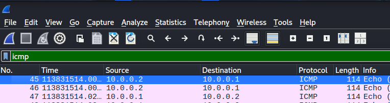

# ICMP Packet Analysis using Wireshark📡

## Objective 📌
The objective of this analysis is to understand ICMP communication by
examining echo request and echo reply packets using Wireshark.

## Tool Used
- Wireshark

## Data Source
The PCAP file used for this analysis was provided as part of a
structured cybersecurity training lab for hands-on learning.

## Method / Filter 🔍
The PCAP file was opened in Wireshark and the following display filter
was applied to isolate ICMP traffic:

### ICMP Filter

## Analysis Performed
ICMP packets were analyzed to observe communication between a source
and destination system. The analysis focused on echo request and echo
reply messages, which are commonly generated using the ping command.

### ICMP Echo Request (Type 8)
Type 8 indicates an ICMP Echo Request, commonly used by the ping command
to test network connectivity.

### ICMP Echo Reply (Type 0)
Type 0 indicates an ICMP Echo Reply, confirming that the destination host
successfully responded to the echo request.

## Observations
- ICMP Echo Request packets (Type 8) were sent from the source system.
- ICMP Echo Reply packets (Type 0) were received from the destination.
- Matching request and reply packets confirm successful network connectivity.
- Source and destination IP addresses were observed for each packet.

## Packet Details
- Protocol: ICMP
- Echo Request Type: 8
- Echo Reply Type: 0
- Code: 0

## Security Importance
ICMP is used for network diagnostics and troubleshooting. However,
attackers may misuse ICMP for network scanning and reconnaissance.
Monitoring ICMP traffic helps security analysts detect suspicious
probing or unauthorized network activity.

## Conclusion
This ICMP analysis provided practical experience in packet-level
network traffic analysis using Wireshark and improved understanding
of how ICMP communication works in real networks.
