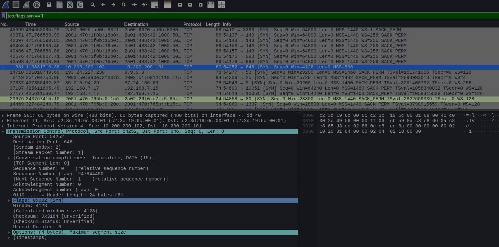
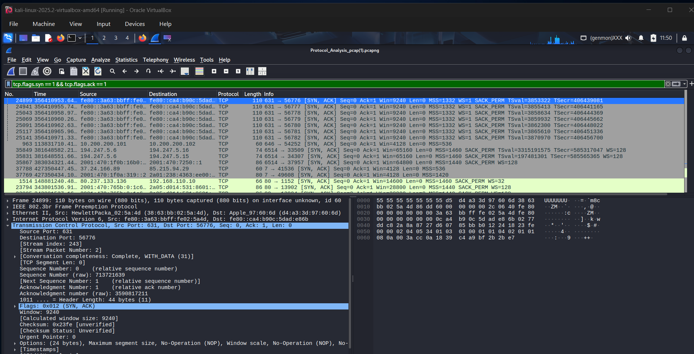
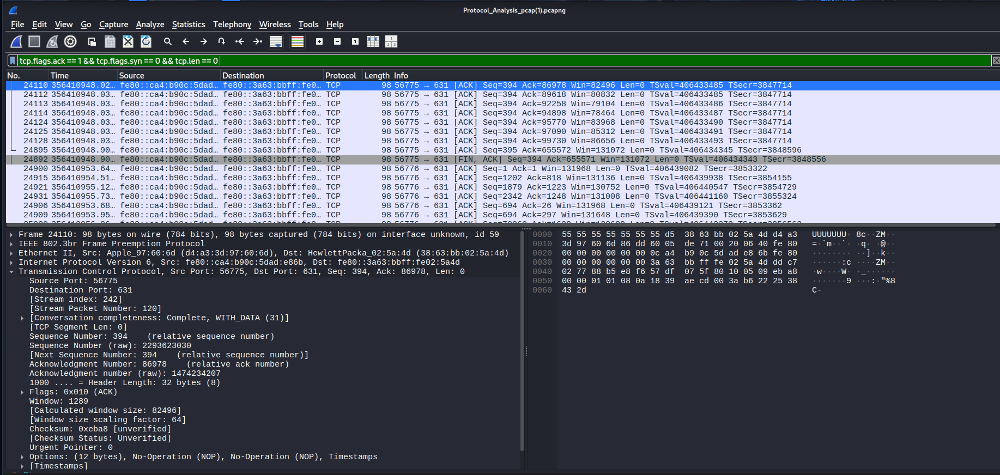

# TCP Packet Analysis using Wireshark

## Objective
The objective of this analysis is to understand how TCP establishes,
maintains, and terminates reliable connections by analyzing packet-level
TCP communication using Wireshark.

## Tool Used
- Wireshark

## Data Source
The PCAP file used for this analysis was provided as part of a structured
cybersecurity training lab for hands-on learning.

## Method / Filter
The PCAP file was opened in Wireshark and TCP traffic was isolated using
Wireshark display filters to analyze connection establishment and control
flags.

---

## Common TCP Display Filters Used
The following TCP display filters were used during analysis to isolate
specific TCP behaviors:

| Filter | Description |
|------|------------|
| `tcp` | Show all TCP packets |
| `tcp.flags.syn == 1` | Show SYN packets (start of connection) |
| `tcp.flags.fin == 1` | Show FIN packets (end of connection) |
| `tcp.port == 80` | Show TCP packets on port 80 |
| `ip.addr == 192.168.1.1` | TCP traffic to/from a specific host |

---

## Analysis Performed
TCP packets were analyzed to observe the TCP three-way handshake, which
is used to establish a reliable connection between a client and a server.
The handshake consists of SYN, SYN-ACK, and ACK packets.

---

## TCP Packet List
The screenshot below shows TCP traffic filtered using the `tcp` display
filter, highlighting multiple TCP packets involved in connection setup
and communication.

---

## TCP Three-Way Handshake

### TCP SYN (Connection Initiation)
The SYN packet is sent by the client to initiate a TCP connection with
the server. This packet indicates a request to start communication.

---

### TCP SYN-ACK (Server Response)
The SYN-ACK packet is sent by the server in response to the SYN request.
It acknowledges the request and indicates readiness to establish the
connection.

---

### TCP ACK (Connection Established)
The ACK packet completes the TCP three-way handshake. This packet confirms
that the client received the server’s response and that the connection
is successfully established. This handshake ACK contains no data.

## TCP Connection Termination 
TCP connections are closed using FIN packets. A FIN packet indicates that
one side has finished sending data and wishes to close the connection.

---

## Observations
- TCP connections were established using the three-way handshake.
- SYN, SYN-ACK, and ACK flags were observed in the correct sequence.
- Handshake ACK packets contained no data (`Len = 0`).
- Source and destination IP addresses and ports were clearly identified.
- TCP communication was confirmed to be reliable and ordered.

---

## Packet Details
- Protocol: TCP
- Key Flags Observed: SYN, SYN-ACK, ACK
- Source Port and Destination Port identified
- Sequence and Acknowledgment numbers observed
- TCP window size and options present

---

## Security Importance
TCP is widely used for web traffic, email, and application communication.
Attackers may abuse TCP behavior through techniques such as SYN scanning,
connection flooding, or session hijacking. Monitoring TCP flags and
handshake behavior helps security analysts identify abnormal or malicious
network activity.
 
---

## Conclusion
This TCP analysis provided hands-on experience in understanding how
reliable connections are established using the TCP three-way handshake.
Analyzing TCP flags and packet flow in Wireshark strengthened practical
network traffic analysis skills relevant to cybersecurity and SOC roles.
